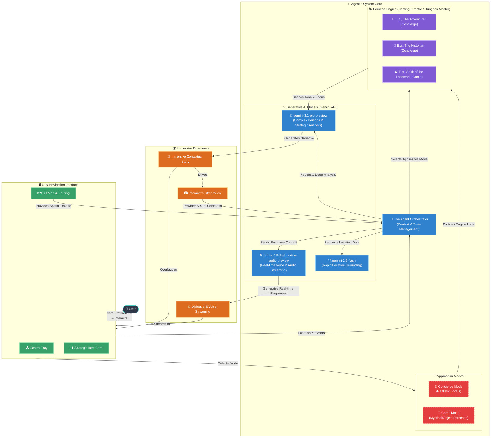

# Travigo
Where live agents meet immersive storytelling and 3D navigation

## Project Description

Travigo is a **next-generation AI Agent** that utilizes multimodal inputs and outputs, moving far beyond simple text-in/text-out interactions. The project leverages Google's Gen AI SDK, Gemini Live API, Gemini 3, Google Maps API cloud services with the creative power of generative AI and spatial context to solve complex problems and create entirely new, immersive user experiences in 3D navigation and storytelling.

### Features & Functionality
- **Multimodal Interactions:** Communicate via voice and text while the AI processes real-time visual context from the interactive Street View and 3D map spatial data.
- **Dynamic Personas:** Choose between Concierge Mode (realistic local guides) and Game Mode (mystical/run-time personas) adapting tone and narrative focus on the fly.
- **Real-time Context Processing:** Uses a Live Agent Orchestrator to stream dialogue & voice directly tied to user actions and spatial events.
- **Immersive Storytelling:** Generates contextual narratives overlaid seamlessly onto the UI and 3D environment.

### Technologies Used
- **Frontend / UI:** Next.js, React, 3D Map & Routing Integration
- **Backend / Logic:** Agentic System Core, Node.js
- **APIs:** Google's Live API, Google Maps API

### Models Used
The project utilizes a multi-model architecture, leveraging different Gemini models depending on the task:
- **gemini-2.5-flash-native-audio-preview**: Used by the Live Agent Orchestrator to power real-time, multimodal conversations via voice and audio streaming.
- **gemini-2.5-flash**: Used for rapid "Scout" queries, specifically grounding location searches using the Google Maps tool.
- **gemini-3.1-pro-preview**: Used for complex reasoning tasks via High Thinking levels, such as generating fictional personas based on spatial context and performing deep "Strategic Analysis" (e.g., visa planning, historic deep dives) grounded by Google Search.

## Test the project Locally

**Prerequisites:**  Node.js

1. Install dependencies:
   `npm install`
2. Set the API Keys `GEMINI_API_KEY=''` & `GOOGLE_MAPS_API_KEY=''` in [.env.local](.env.local) to your keys.
3. Run the app:
   `npm run dev`

## Architecture Diagram

