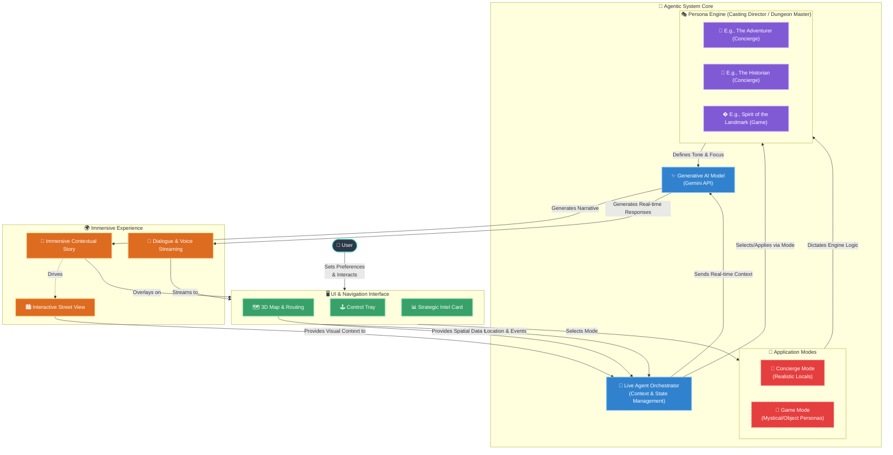

# Travigo
Where live agents meet immersive storytelling and 3D navigation

## Test the project Locally

**Prerequisites:**  Node.js

1. Install dependencies:
   `npm install`
2. Set the API Keys `GEMINI_API_KEY=''` & `GOOGLE_MAPS_API_KEY=''` in [.env.local](.env.local) to your keys.
3. Run the app:
   `npm run dev`

## Architecture Diagram

